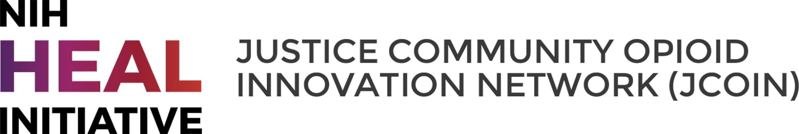

## Preface {.unnumbered}

Measurements of neighborhood **social determinants of health** and the **structural drivers** of health inequity are increasingly urgent in modern public health thinking, and are thought to drive and/or reinforce social and spatial inequities. Spatial analysis is an important tool in uncovering the ways in which where people live, work, and play can influence health outcomes.

This workshop will present an introduction to spatial analysis, mapping, and GIScience for health applications & spatial epidemiology using the open source R environment. We use an open scienceframework including **R** and **GeoDa**, meaning all the GIS is done with free and open tools in a reproducible environment. We will review how research questions and hypotheses are updated at each stage of exploratory spatial data analysis.

### Commitment {.unnumbered}

This workbook is a 3-4 hour, fast-paced overview of mapping, GIScience, and spatial analysis basics for health professionals. When including extensive live coding, support, and additional practice in-person or at home on your own, it can be extended to a week-long program at minimum. You are encouraged to update with your own data finds after each example.

## What You'll Need {.unnumbered}

This workbook is designed to work with a live component, where the concepts are shared with more details and followed by live coding. Check out these links to stay updated:

- Short link to this workbook: [go.illinois.edu/SpatialR](https://go.illinois.edu/SpatialR)
- Slide deck for latest workshop: [SER 2026](https://docs.google.com/presentation/d/1WR3-d4IU-WDSVN4oFgFjxbZADtMAExWUBFmqVuvum84/edit?slide=id.gddd9c4a96c_1_138#slide=id.gddd9c4a96c_1_138)

In addition to this workbook, you'll need a working instance of R and the data. You can also clone the [Github repository](https://github.com/healthyregions/Spatial-Health-Workshop) that hosts this workbook to get direct access to all the working code, [data](https://github.com/healthyregions/Spatial-Health-Workshop/blob/main/data), and additional items.

```{r echo=FALSE}

library(downloadthis)

download_link(
  link = "https://github.com/healthyregions/Spatial-Health-Workshop/blob/main/data/Data-2026.zip",
  button_label = "Download Workshop Data",
  button_type = "primary",
  has_icon = TRUE,
  icon = "fa fa-save",
  self_contained = FALSE
)
```

## Software Basics {.unnumbered}

We assume a basic knowledge of R and coding languages for most sections. For most of the tutorials in this toolkit, you’ll need to have R and RStudio downloaded and installed on your system. You should be able to install packages, know how to find the address to a folder on your computer system, and have very basic familiarity with R. If you are new to R, we recommend the following [intro-level tutorials](https://support.posit.co/hc/en-us/articles/201141096-Getting-Started-with-R) provided through [installation](https://rstudio-education.github.io/hopr/starting.html) guides. You can also refer to this [R for Social Scientists](https://datacarpentry.org/r-socialsci/) tutorial developed by *Data Carpentry* for a refresher.

We will work with following libraries, so please be sure to install:

- `tidyverse` or `dplyr`
- `sf`
- `tmap`
- `tidygeocoder`
- `tidycensus`

To install a package in R, input `install.packages("dplyr")` in your console. You generally only need to install a library once, but you'll call it every time you work with a new R session.

::: callout-tip
## Setting up your environment

We recommend setting up your working directory as soon as you can! Create a new folder called "data" to put all the data you've downloaded for the workshop.
:::

There are differing spatial ecosystems in R. We use the `sf` ecosystem that is compatible with the `tidyverse`. If you need to work between these two R spatial ecosystems, see [this guide](https://github.com/r-spatial/sf/wiki/Migrating) for a translation of `sp` to `sf` commands.

## Author Team {.unnumbered}

The workbook was reworked with more general introductions from the [Opioid Environment Toolkit](https://healthy%20regions.github.io/opioid-environment-toolkit) by Marynia Kolak, Director of the [Healthy Regions & Policies Lab](http://www.healthyregions.org) (University of Illinois at Urbana-Champaign), with contributions and co-facilitation by Ashlynn Wimer (Harvard T. H. Chan), Qinyun Lin (University of Gothenburg), and Susan Paykin (University of Chicago).

This suite of tutorials was originally developed for a workshop at the 2021 R-Medicine Conference, and has sinced been updated for multiple workshops at the Society for Epidemiology Research Annual Meeting, and as a workshop at the Institute of Medicine at the University of Gothenburg (Göteborg).

The original toolkits were developed for the [JCOIN Network](https://heal.nih.gov/research/research-to-practice/jcoin) by Marynia Kolak, Moksha Menghaney, Qinyun Lin, and Angela Li at the Healthy Regions & Policies Lab as part of the Methodology and Advanced Analytics Resource Center (MAARC). Susan Paykin and Yilin Liu have contributed substantially as workshop facilitators. The Healthy Regions Lab is based out the University of Illinois at Urbana-Champaign, and serves as the Geospatial Core home of the MAARC, which is situated at the University of Chicago.

JCOIN is part of the of the NIH HEAL Initiative. The Helping to End Addiction Long-term Initiative, or NIH HEAL Initiative, supports a wide range of programs to develop new or improved prevention and treatment strategies for opioid addiction.

## Acknowledgements {.unnumbered}

This research was supported by the National Institutes of Health through the NIH HEAL Initiative under award number [1U2CDA050098-01](https://reporter.nih.gov/search/3wdLGk3ipEyheDa26AEwDA/project-details/9882805#description) and [5UM1DA050098-03](https://reporter.nih.gov/project-details/11129703#description). The contents of this publication are solely the responsibility of the authors and do not necessarily represent the official views of the NIH, the NIH HEAL Initiative, or the participating sites.

```{r, echo=F}


```
