# Spatial Hotspots

Exploratory Spatial Data Analysis requires us to review the variable of interest multiple ways, with different methods, to detect patterns and uncover interesting trends. However, our minds are wired to see patterns, whether or not they are (statistically) there.

In this chapter, we'll test the COVID regional pattern we identified previously for statistically significant spatial clustering (or outlier) behavior. Our null hypothesis is spatial randomness; if the LISA (local indicator of spatial autocorrelation) for an area is high and statistically significant, we've identified a "hot spot" spatial cluster. (In other words, that area and it's neighbors have higher rates of COVID cases, when compared to a spatially random map.) If the area has a low and statistically significant finding, it's also a spatial cluster, but a cold spot. We can also detect spatial outliers, as discussed in the workshop. How we define neighbors will influence our findings.

## Open GeoDa

For this exercise, we'll move over to **GeoDa**, a free and open spatial statistical software that works across operating systems. To download, go to the [GeoDa Website](http://geodacenter.github.io), click on the *Download* tab, and select the most recent stable version that is compatible with your operating system. If you're on a Mac system, you'll likely have to update your Settings to allow downloading from the source.

When opening GeoDa, you'll see a very simple interface with two toolbars: the navigation panel at the very top, and a toolbar that can be moved anywhere, below it.

```{r echo=FALSE}

knitr::include_graphics('img/open-geoda.png')
```

### Load Data

Next, let's load some data. Click on the blue folder icon on the left side of the toolbar, and select the .geojson file we generated earlier. In this example, we can load a version we loaded earlier, `ChiZipMaster.geojson`. Note you'll need to select the type of spatial data format first.

```{r echo=FALSE}

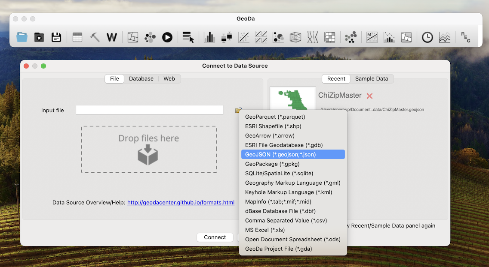
```

### Data Inspection

The spatial view of the data opens on default. To explore the non-spatial, corresponding data attributes, click on the Table icon in the toolbar. The views are linked, meaning you can click on a row in the table, and the corresponding Zip will get highlighted in the map. If you click on a zip code in the map, right-click anywhere on the Table and select "Move Selected to Top" for easy viewing.

```{r echo=FALSE}

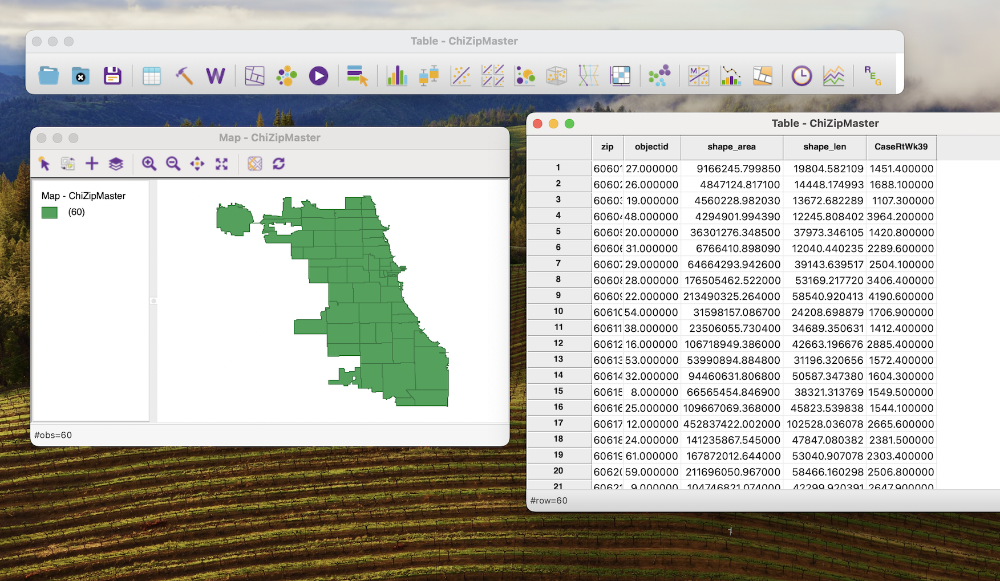
```

## Identify Patterns

Let's replicate a choropleth map from a previous exercise. In this case, we'll generate a Natural Breaks (Jenks) map. Click on the Map icon in the toolbar (hover over the icons until you find it, if needed), and select "Natural Breaks" with 4 intervals.

```{r echo=FALSE}

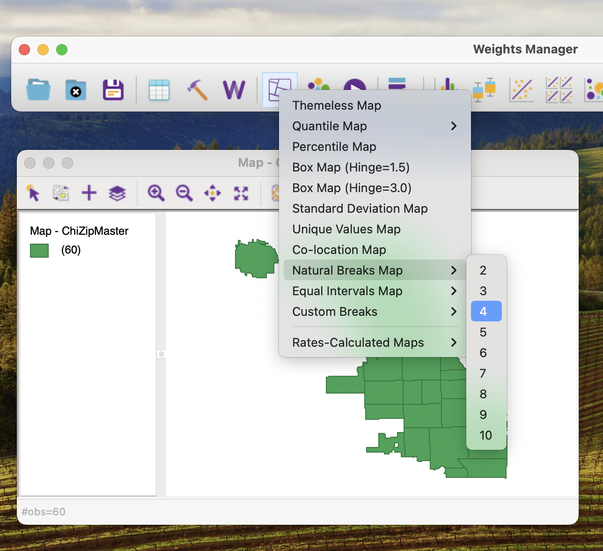
```

Then, select the Covid Case Rate variable we generated prior. Explore!

```{r echo=FALSE}
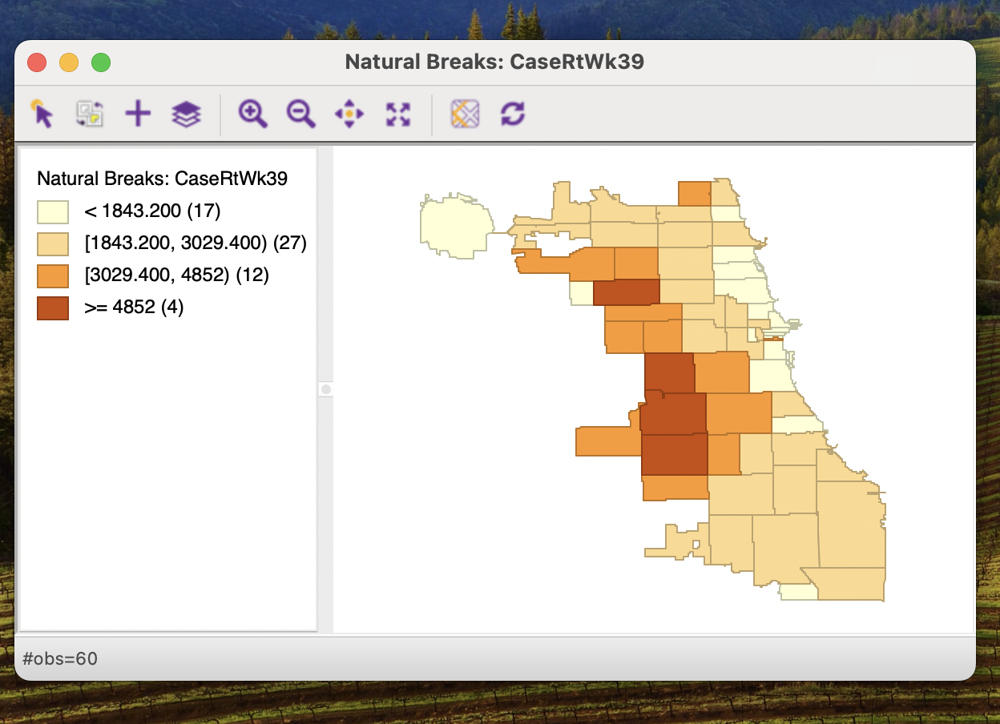
```

## Spatial Weights

We previously hypothesized distinct spatial patterning in Covid Cases for Week 39 in Chicago, but even with choropleth mapping, that hypothesis remains untested. To test for spatial autocorrelation, we'll need to test against a null hypothesis of spatial randomness. To test for spatial randomness, we need to first generate a spatial structure that represents the neighbor relationships in our data. Specifically, we will generate a Spatial Weight, which is a matrix that records all the relationships across spatial data observations.

For this, let's click on the 'W' icon in GeoDa, to generate a spatial weight, or W. Click on the corresponding button to Create a spatial weight. Select the index ID, or zip, in this case. If your data doesn't have an index ID, you can generate one here with one click.

Next, we'll start with a Queen 1st-Order contiguity spatial weight. Save the file using an appropriate annotation that indicates the type of spatial weight, for example appending "q1" to the end of the file name. Weights are stored as `.gal` file formats.

```{r echo=FALSE}
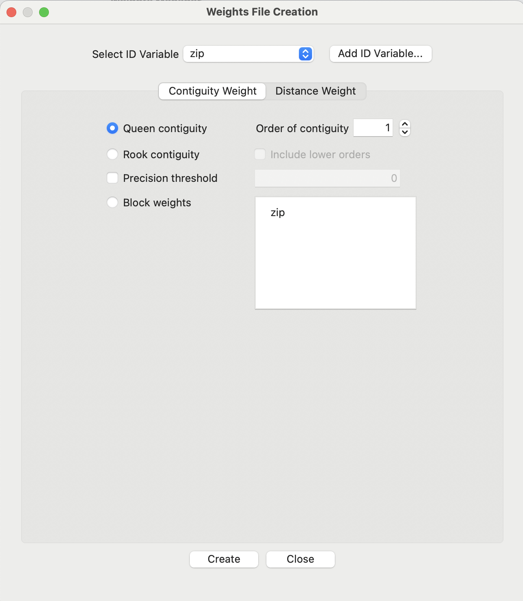
```

Note that we have a neighborless observation, which upon further exploration, may have resulted from a spatial data topology error. These are more common than you'd think when working with open data portals! If needed, we can remove this row/observation, though we'll continue from here.

In future work, we can try alternative weights like 2nd order contiguity, rook, and KNN (k nearest neighbors). For now, click on the "Connectivity Graph" and explore relationships.

```{r echo=FALSE}
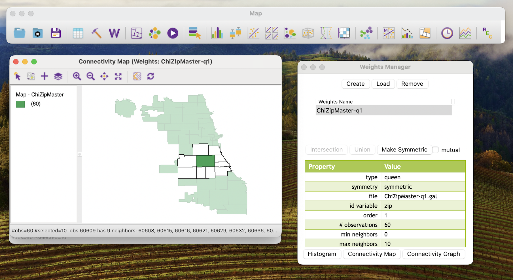
```

## Testing for Spatial Autocorrelation

In GeoDa, we can run a LISA analysis that provides both a Moran's I test (for global spatial autocorrelation), as well as the local indicator of spatial autocorrelation. The LISA will help identify statistical clusters (hotspots and coldspots) as well as spatial outliers.

We select "Univariate Local Moran's I" from the "Space" toolbar in Geoda. Select all options that are presented.

```{r echo=FALSE}
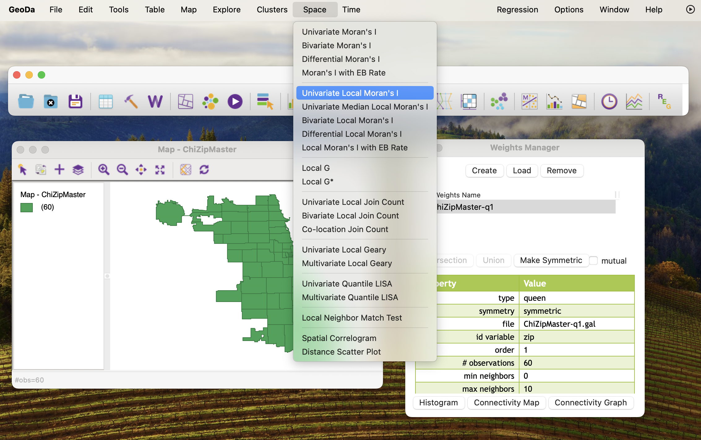
```

Arrange your windows so you can view all options, as below.

```{r echo=FALSE}
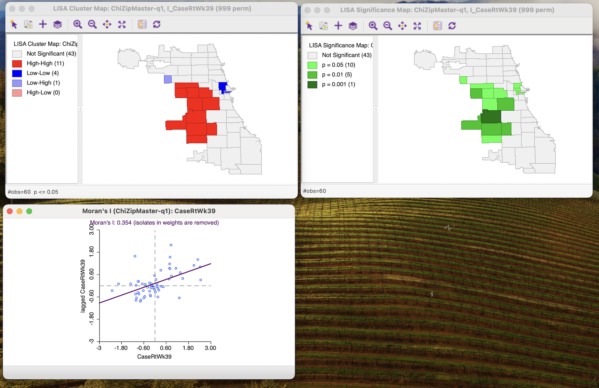
```

### Global Spatial Autocorrelation

We'll start with the Moran's I, at the bottom. On the scatterplot window, right-click to select Randomization, and then select 999 permutations.

```{r echo=FALSE}
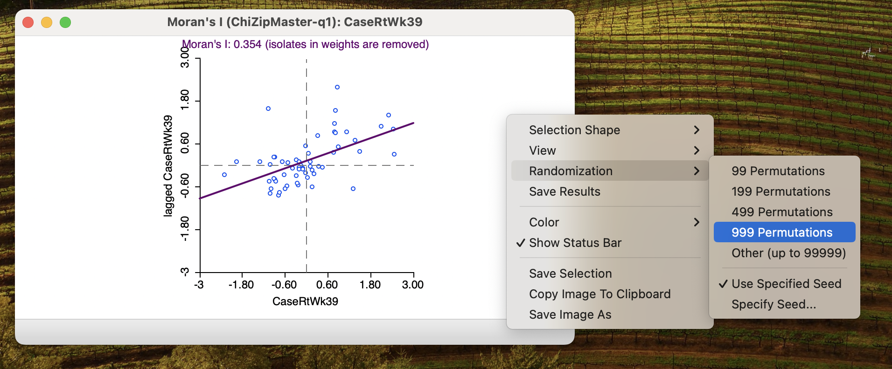
```

This will generate 999 Monte Carlo permutations, reshuffling our data that many times. Out of all those times, the data we actually have does not fill into the distribution generated. That means there is a pseudo p-value of 0.001 of statistical significance. Re-run the permutations a few times to confirm. Our Moran's I value is already relatively high (above 0.30), meaning we very likely have a very (positively) spatially clustered data phenomenon.

```{r echo=FALSE}
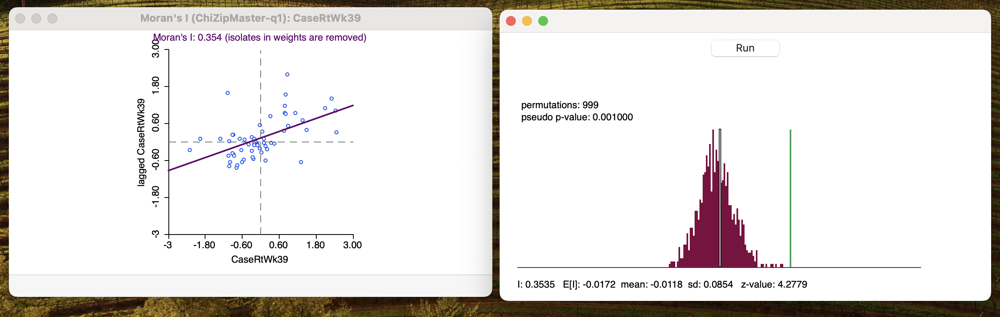
```

::: callout-tip
## Reporting the Morans' I

When reporting the Moran's I, be sure to specify I statistic with the z-value. Different spatial weights can be evaluated using the z-value. The pseudo p-value, along with the total number of permutations generated, should also be included.
:::

### Local Spatial Autocorrelation

Next, let's focus on the LISA maps at the top of our window. In this example, we see a few zip codes with a bright red color, corresponding to "high-high" values, meaning positive spatial clustering, or statistical hot spots.

```{r echo=FALSE}
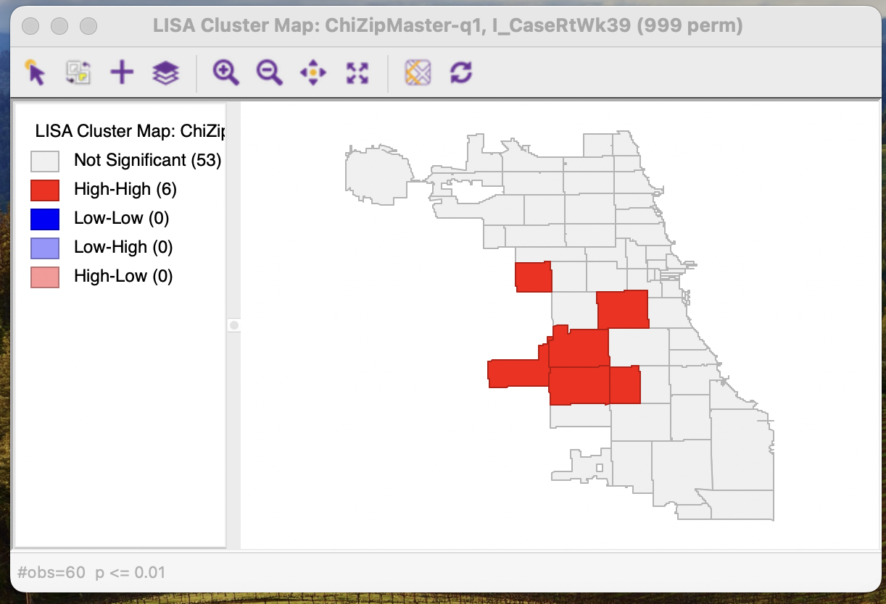
```

You can filter the significance levels to explore how things change with stricter assumptions. Note that the colors correspond to the *center* of the cluster, meaning the neighbors are also part of the cluster, though they may not be showing the corresponding color. Using the p=0.05 significance level ends of being similar to using the p=0.01 level showing cluster cores and their neighbors, so is often used in reporting.

```{r echo=FALSE}
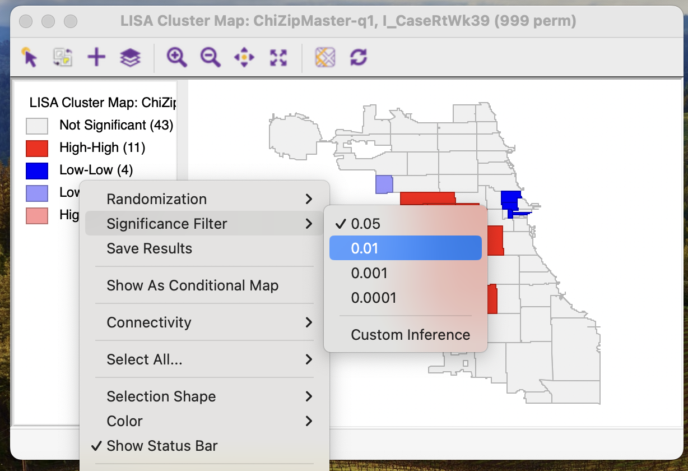
```

### Save Results

To save the results to your data, right-click anywhere on the LISA map to save results. The LISA values, categories, and significance levels can all be added to the data, and renamed if you'd like.

```{r echo=FALSE}
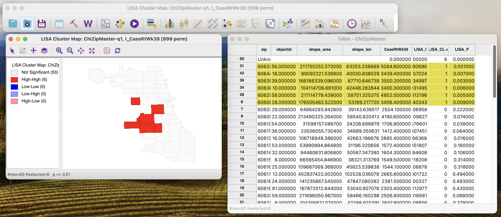
```

Save the data to have your file updated. You can click on the "Disk" icon in the toolbar, or go to File/Save.

From here, you can re-load into R to map and explore further.

## Rinse & Repeat

Try generating additional spatial weights, and repeating the process. How did the LISA maps change? Did the Morans' I change, suggesting some ways of operationalizing neighbors is more linked with spatially clustered patterns?

In particular, look for some of the "Easter Eggs" found in the dataset when new weights are used. Which configurations generate the following:

- Statistical Cold Spots
- Statistical Spatial Outliers

Brainstorm what processes may generate these results. What did the spatial patterns observed demonstrate about underlying processes?

## More Resources {.unnumbered}

General resources & examples:

- [GeoDa Center: Documentation](http://geodacenter.github.io/documentation)
- [Spatial Analysis Textbook: LISA](https://www.spatialanalysisonline.com/HTML/local_indicators_of_spatial_as.htm)
- [US Covid Atlas: Learn HotSpot Maps](https://uscovidatlas.org/learn/hotspot-maps)
- [Visualizing Public Health Data: Using the U.S. Covid Atlas and GeoDa for Spatial Insights](https://alastore.ala.org/spatial-literacy-public-health-faculty-librarian-teaching-collaborations)

Different clustering approaches:

- [SATScan](https://www.satscan.org)
